# Campaign Management

##### Overview

    - Project in .Net Core 8.0, RESTful API and Blazor Web Assembly. Allows to create, read, update and delete, data from the database.
    This project is a campaign management. We can create users(Employees), customers, campaigns, and emails.
    This project implement the SOLID principles.

### Architecture Design Task

    - Design a system architecture diagram showcasing:
      • The overall architecture of the CDP highlights the .NET and Blazor components.
      • How data flows from ingestion to storage, analysis, and campaign management and analytics.
      • The integration points with external services (e.g., email delivery services).
      • Authentication and security mechanisms.

    To create the architecture diagram, you can use any diagramming tool you are comfortable with (e.g., draw.io, Lucidchart).

### Coding Challenge

    • API Development: Implement a RESTful API endpoint using .NET that accepts JSON payloads for customer data. The endpoint should validate and store the data in a database or memory.

    • Blazor Component: Develop a Blazor component responsible for sending customer data to the API

### Features

    - RESTful API;
    - CRUD methods;
    - MySQL;
    - Entity Framework Core;
    - Blazor Assembly;
    - .Env;
    - Json Web Token;
    - BCrypt;
    - UnitTests (xUnit);

### Project Description

    - This project start with a blank. Have a API(RESTful) endpoint project that accepts JSON payloads.
    - Have a Blazor Web Assembly project for UI, where users(Employees) interact, and this project do requests to the API.
    - Have a class library, for the domain models.
    - Have a class library, for the data transfer object's(DTO).
    - Have a class library, for the Enum.
    - Have a class library, for the services, to interact with the database.
    - Have a xUnit project, for the unit tests.

    - The application, have a login and register system, that can identify if username and email, is already use by another user(employee), as well, if the email for the customer is already taken.
    There is a hierarchy system(claims), that means, we can create a user, a manager and a admin. And this allows access or less, depending on the level, to the pages.

    - The Application, allows to create campaign(CRUD), customers(CRUD), Email(CRUD). Have pagination, relationships between models, validation for models.

    - The log in if we forget to log out, have a timer, and log out after this time.

### Installation

    - Clone the repository;
    - Create the database in your MySQL;
    - Configure the database connection string in the .Env file;
    - Create a .env file to put your credentials, and update the db config to use your info:
      CONNECTIONSTRING="your-connection-string"
      JWT_ISSUER_PRODUCTION="your-issuer-production"
      JWT_AUDIENCE_PRODUCTION="your-audience-production"
      JWT_SECRET="your-password"
      JWT_ISSUER_DEV="your-issuer-dev"
      JWT_AUDIENCE_DEV="your-audience-dev"
    - With your models, just create the appropriate migrations;

### Screenshots

    1 - Architecture Diagram;

  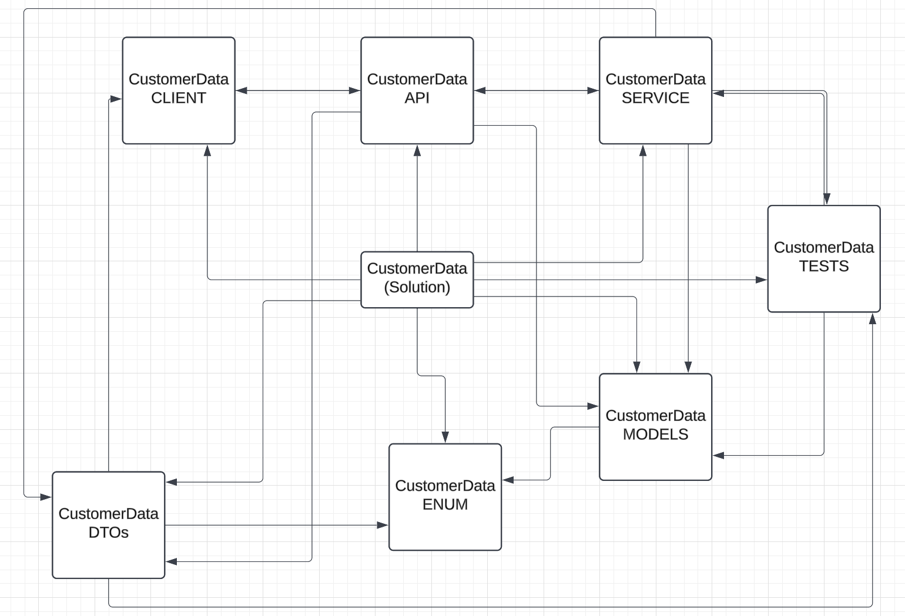

    2 - Models Diagram;

  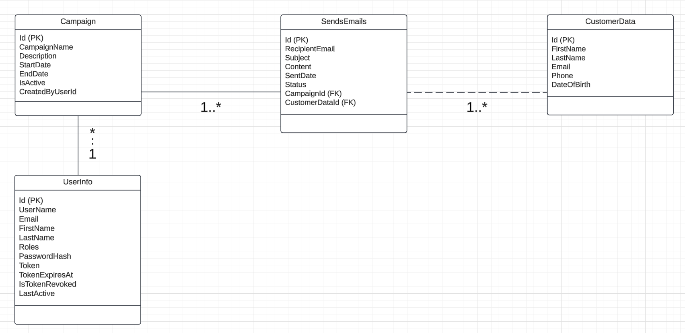

    3 - Home Page;

  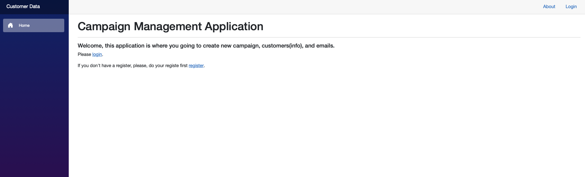

    4 - Login Page;

  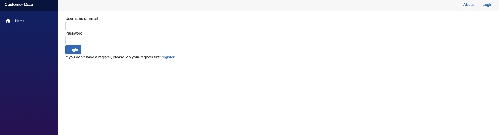

    5 - Register Page;

  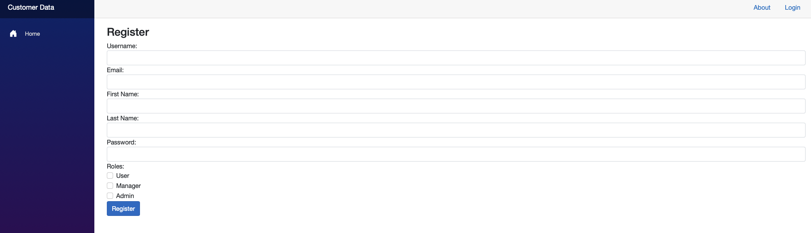

    6 - List Emails;

  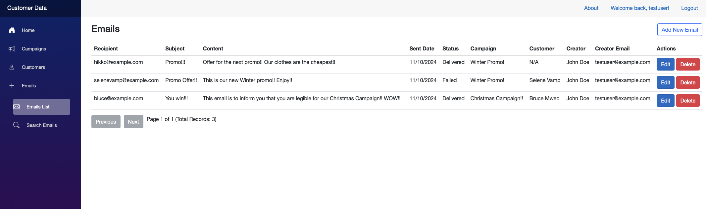

    7 - List Campaigns;

  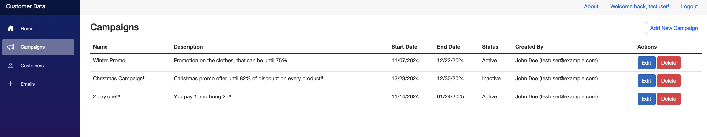

    8 - List Customers;

  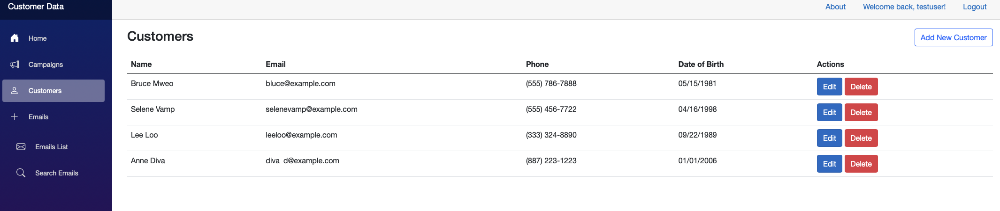

    9 - Add Email;

  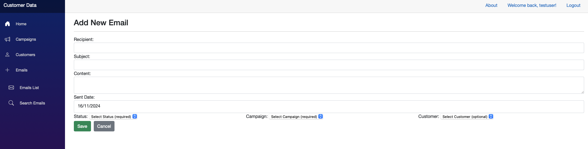

    10 - Add Campaign;

  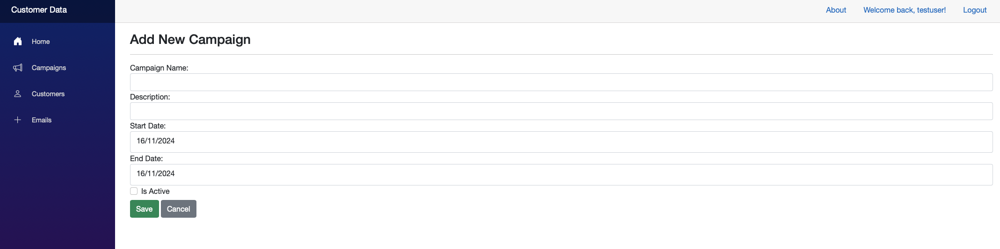

    11 - Add Customer;

  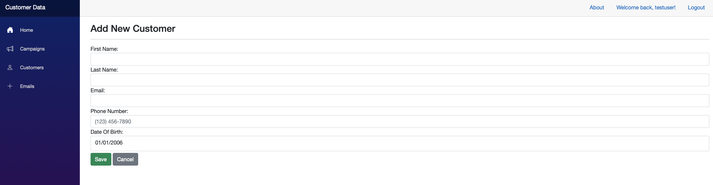

    12 - Edit Email;

  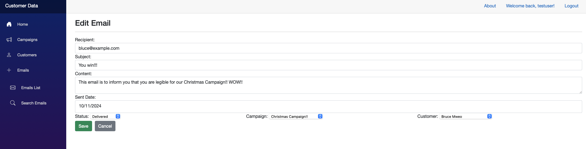

    13 - Edit Campaign;

  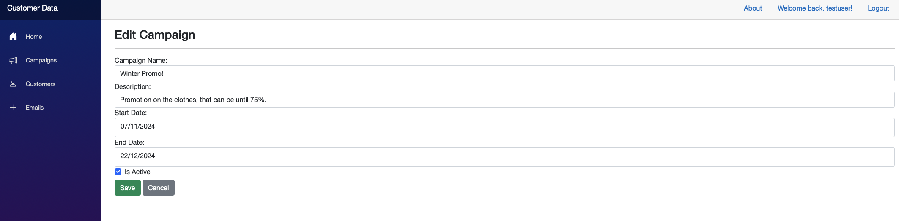

    14 - Edit Customer;

  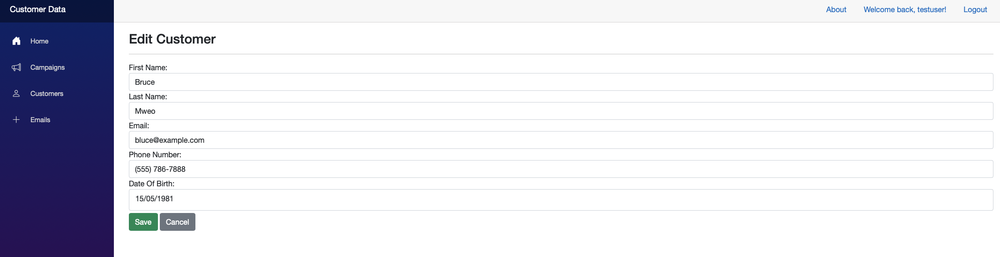

    15 - Delete Email;

  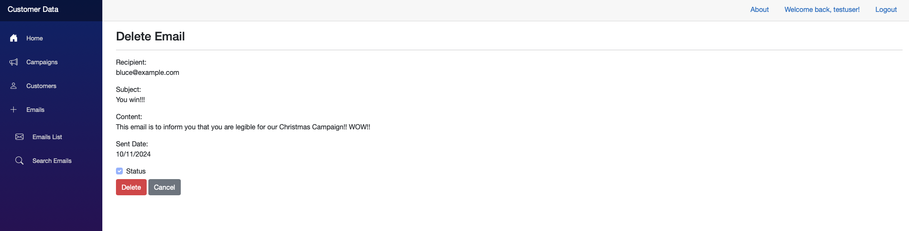

    16 - Delete Campaign;

  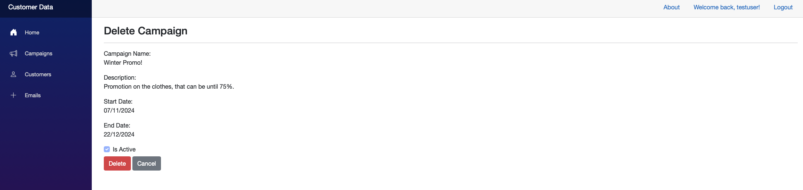

    17 - Delete Cutomer;

  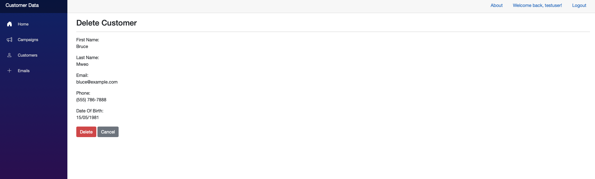

    18 - Search Emails;

  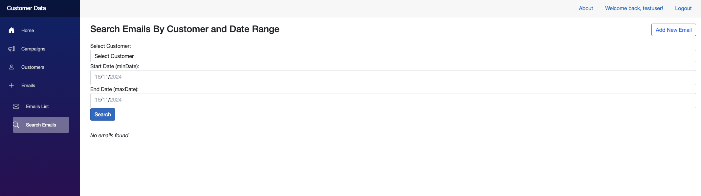

    19 - Search Emails with result;

  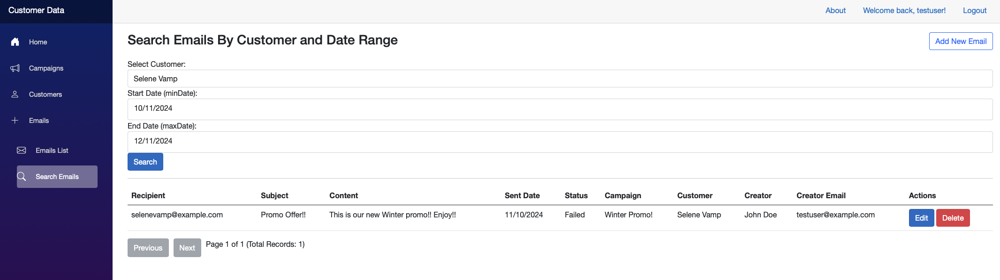

    20 - About Page;

  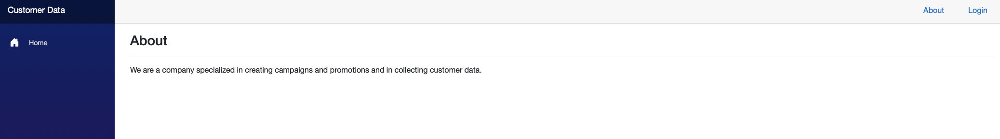

